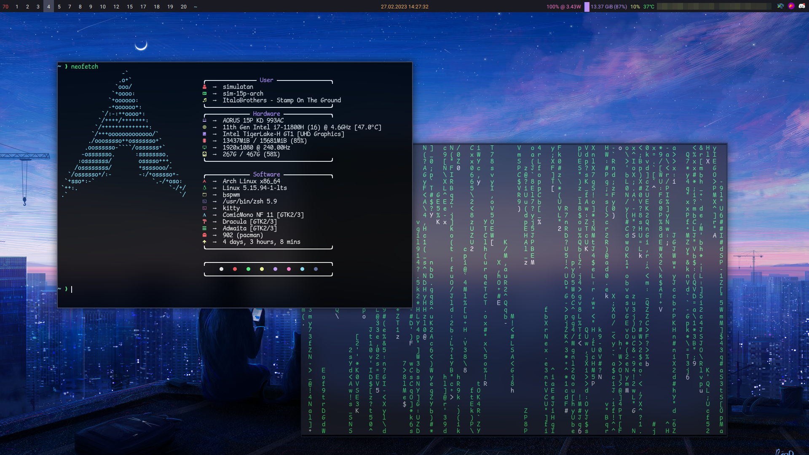

# Dotfiles (Dracula)
Hello and welcome to my dotfiles repository!

This repo contains the most important config files from my linux installations.

I configured most of the things in this repo to follow the [**dracula theme color palette**](https://draculatheme.com/contribute#color-palette).

## Screenshots

|||
|---|---|
|Volume Notification|Vim Setup|

## Software
|Category|(Package-)Name|
|--|--|
|WM|bspwm|
|Terminal|kitty|
|Shell|zsh|
|Bar|polybar|
|Compositor|picom|
|Editor|neovim|
|Notifications|dunst|
|Specs Display|neofetch|
|Utility Scripts|volume, lock (package "bin", uses `betterlockscreen`, `i3lock-color` or `i3lock`)|

## Fonts
[Fontawesome](https://use.fontawesome.com/releases/v6.1.1/fontawesome-free-6.1.1-desktop.zip
) and [JetBrains Mono Nerd](https://github.com/ryanoasis/nerd-fonts)
_links lead to the things downloaded by the script_

Install these fonts either manually or by running the `install-fonts.sh` script in the root dir of the repo.

## How to install my dotfiles
### Installing dependencies
Required packages for the different packages / configs can be found in the `.packages` file of the config directory (made on arch, which means that most required packages should be included. For example, `xcwd` is pre-installed on fedora, meaning you wouldn't be able to tell that it's a dependency that needs to be installed elsewhere).

My recommendation is to craft a simple script that installs the required dependencies with your package manager.
For example (pacman): `sudo pacman -S $(cat .packages | sed '/#/d' | grep -v "^[?]" | tr -d '>+?' | tr '\n' ' ')`
This script will install all dependencies *except* packages that are prefixed with `?` (packages that can be useful but aren't requried). To ignore more dependencies, add the prefix char to the  `grep` call in the `[]`, for example: `^[?]` -> `^[?+]` to only install required packages (and the core)

#### `.packages` syntax
- `PACKAGE`: this package is _required_
- `>PACKAGE`: this package is the _core_ of the package, for example `i3-gaps` for the `i3` config.
- `+PACKAGE`: this package is _not required_, but _recommended_
- `?PACKAGE`: this package is _not required_, but _can be useful_
- `# COMMENT`: these lines contain comments regarding the package, like when you should install it or what it's useful for, these lines should be skipped in your install script

### Installing the configs
I use [dotter](https://github.com/SuperCuber/Dotter) to manage the dotfiles and bring them to the right place, see [it's wiki](https://github.com/SuperCuber/dotter/wiki).
Essentially, clone and just run `./dotter deploy` after adding `packages = [ "package1", "package2" ]` _(note: find the available packages in the `.dotter/global.toml` file)_ to your `.dotter/local.toml`. That'll symlink or copy your files in place.

## Configuring and variables

This section will show the available variables as of c6dc1a6, read the source to find out the current variables.

### zsh
- `plugins`: the OhmyZSH plugins to use
- `plugins_extra`: if you want to have additional plugins on top of the default of the `plugins` variable, add the names here.
- `plugins_external`: plugins on GitHub in the format `user/repo` - to be added by `zinit`
- `editor`: what editor to use (sets the `EDITOR` env variable)
- `java_dir`: my ZSHRC will search this location for the newest available java installation and configure the shell to use that one. Useful if you install java through IntelliJ and can't be bothered to manually update the shell to use the newest update

### WM
- `terminal`: the terminal to open when pressing `super + t`
- `terminal_arguments`: arguments to add to the `terminal` executeable, for example `xcwd` (outputs the directory open in the terminal that's currently focused, tested in kitty) like this: `$(xcwd)`
- `task_manager`: the command to run in the `terminal` to start the task manager
- `file_manager`: the command to run in the `terminal` to start the file manager

### i3
- `file_manager`: the file manager to open when pressing `super + e`

### polybar
- `keyboard_id`: the ID of the keyboard to use for the [hackspeed](https://github.com/polybar/polybar-scripts/tree/686f211546b77ced32a8487fe8c2a48f3b59c190/polybar-scripts/info-hackspeed) module
  get by running `xinput test-xi2 --root | grep \(KeyPress\) -A 1`, typing something, and then reading the `device` field
- `battery_id`: the ID of the battery to display in polybar
  get by running `ls -1 /sys/class/power_supply/`
- `thermal_zone`: the ID of the sensor to use for the temperature monitor
  get by running `for i in /sys/class/thermal/thermal_zone*; do echo "$i: $(<$i/type)"; done` and choosing the right one

## Available scripts
_NOTE: All scripts (except for `install-fonts.sh`) are symlinked into the `bin` directory_
_thus, you have to enable the `bin` package in your `.dotter/local.toml` file_
- `install-fonts.sh`: automatically installs the required fonts for my setup
- `bin/caps-lock.sh` call to send a caps lock notification - bind it on the _release_ of the caps lock key
- `bin/lock.sh`: locks the screen with either `i3lock-color` or vanilla `i3lock`, depending on what you have installed
- `bin/volume.sh`: call to send a volume notification, [see above](#Screenshots)
- `polybar/currently-playing`: prints the current playing song using the `playerctl` utility
- `polybar/dunst-mute-status.sh`: displays either `Dunst muted` or nothing
- `polybar/pacman-aur-updates.sh`: prints the number of total package upgrades (pacman + aur)
- `rofi/power-menu.sh`: shows a rofi menu to manage power state on your device (power off, lock, logout, suspend)
- `rofi/sxhkd-keybinds.sh`: shows a rofi menu with an overview of the keybinds declared in the SXHKD config file
- `rofi/vpn.sh`: shows a rofi menu to select or disconnect from a vpn (uses `nmcli`)
- `rofi/wifi-menu.sh`: shows a rofi menu to select or disconnect from a wifi network (uses `nmcli`)

